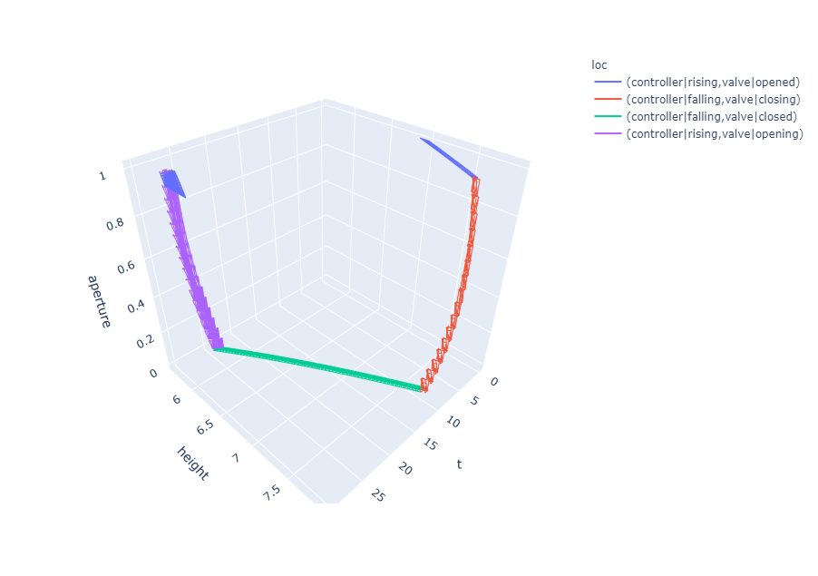

# Ariadne Dashboard



## Utility for plotting and interactive visualization of evolutions and automatons of Ariadne systems.

### Objectives:
The original purpose of this project was to implement a trajectory (sequence of hybrid enclosures) plotter and an automaton visualizer on top of the Python 
interface of the [Ariadne](https://github.com/ariadne-cps/ariadne) C++ library.
In the end, we decided to extend the project to the realization of a dashboard for the whole library; this doesn't mean the dashboard is fully covering 
every feature of Ariadne. The top level dependencies are simply:
- [plotly](https://plotly.com/) - interactive 2D/3D plotting of the trajectories
- [dash](https://dash.plotly.com/) - main dashboard interface
- [dash cytoscape](https://dash.plotly.com/cytoscape) - interactive plot of the automatons

In order to save the results, a [YAML](https://yaml.org/) exporter was also on the schedule but at the moment, since there are some incompatibilities with 
MacOS users, this feature is not included yet.


### Installation guide:
- Install [Ariadne](https://www.ariadne-cps.org/installation/) (pyariadne included)
- Clone this repo and install the Python requirements with
```
python -m pip install -r requirements.txt
```
- Run Ariadne Dashboard with
```
python app_launcher.py
```
An additional `-d` will launch the dashboard in debug mode.


## Project for Discrete Hybrid Systems exam @ University of Verona

### People involved:
Students:
- Sebastiano Fregnan - sebastiano.fregnan@studenti.univr.it
- Luigi Palladino - luigi.palladino@studenti.univr.it

Professors:
- Luca Geretti - luca.geretti@univr.it
- Tiziano Villa - tiziano.villa@univr.it
